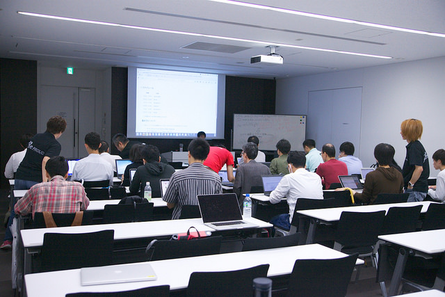
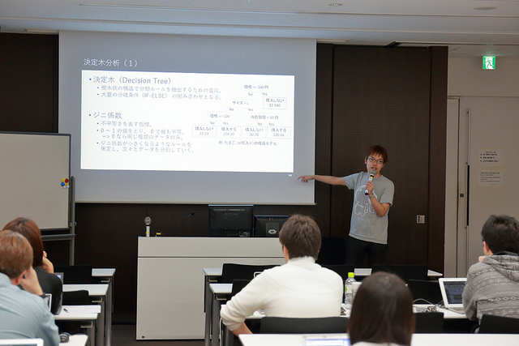
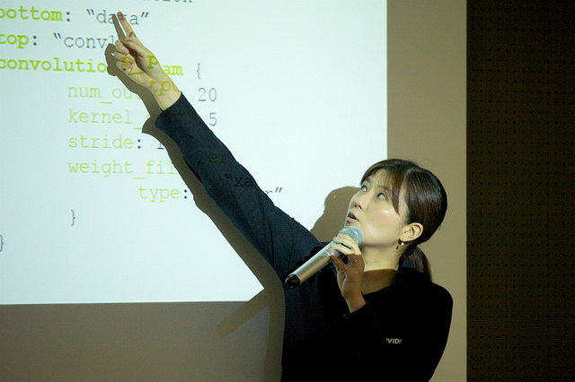
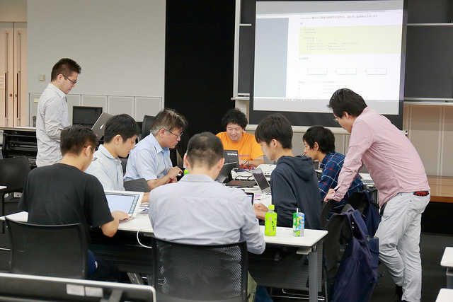
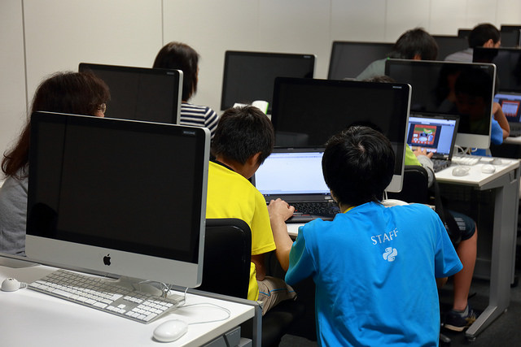

==========================================
第2回 プログラムチームのPyCon JP 2016
==========================================

.. sectionauthor:: ds110

プログラムチーム副座長の齋藤です。
PyCon JP 2016でのプログラムチームのメインの過ごし方は、様々な企画の舵取りをすることです。
今年は3月ごろから準備を始め、企画ごとに各担当者が様々な作業を分担して行ってきました。
今年は以下の企画がありました。

* キーノート
* トークセッション
* 招待講演
* チュートリアル
* ビギナーセッション
* Youth Coder Workshop
* ポスターセッション
* 当日LT
* 2日間スプリント

また、当日はオープニング、クロージングの司会と進行や各トークセッションでの司会と進行が大きな役割です。

本レポートで一挙に各企画についての概要や作業内容を振り返ります。
PyCon JP 2016の雰囲気をこのレポートを通して味わってみてください。

キーノート
---------------------
.. sectionauthor:: Kishin Yagami

キーノート担当の八神です。このセクションでは、キーノート担当のタスクと今年のキーノートの内容をご紹介します。

キーノートスピーカーが決まるまで
^^^^^^^^^^^^^^^^^^^^^^^^^^^^^^^^^^^^^^^

キーノート担当の重要タスクの一つは、キーノートスピーカーの決定です。決定までは、スピーカー候補の提案募集、候補者への投票、スピーカー決めのミーティングというプロセスを経ます。候補となる方には多忙な方が少なくないため、半年前には決まるよう、早めに動き出します。

まずスピーカー候補の提案募集では、「この人のキーノートが聞きたい！」という提案を広く集めます（ `ブログ記事 <http://pyconjp.blogspot.jp/2016/02/pycon-jp-2016-keynote-proposal.html>`_ ）。Python関連のメーリングリスト、PyCon JPブログ、Twitter等で告知し、PyCon JPスタッフでない方からの提案も広く集めます。

余談ですが、募集をかけたところ、自らキーノートスピーカーとして名乗りを上げた方がいました。残念ながらその方はスピーカーとはなりませんでしたが、まさか自ら立候補する方がいるとは思わず、私にとって非常に印象深い出来事でした。

次に、スピーカー候補者への投票を受け付けます（ `ブログ記事 <http://pyconjp.blogspot.jp/2016/02/keynote-vote-and-comment.html>`_ ）。この投票も、PyCon JPスタッフかどうかを問わず、広く受け付けています。

そして、キーノートスピーカー決めのミーティングを開き、キーノートをお願いする人を決めます。得票数だけでなく、こういうテーマはキーノートに良さそう、といった意見も考慮します。

キーノートは目玉イベントの一つであるせいか、このミーティングは毎年大変です。今年も一筋縄ではいかず、例えば投票結果の扱い方、PyCon JP 2016のテーマの反映について、関係者みんなが納得いくような形で決めていくことの難しさを感じました。

このミーティングの結果、今年はJessica McKellarさん、Andrey Vlasovskikhさんのお二人にお願いすることになりました。

.. figure:: /_static/beforereport_01_pyconjp/jessica_profile.jpg

   Jessica McKellarさん

.. figure:: /_static/beforereport_01_pyconjp/andrey_profile.jpg

   Andrey Vlasovskikhさん

キーノートスピーカーのアテンド
^^^^^^^^^^^^^^^^^^^^^^^^^^^^^^^^^^^^^^^

キーノートスピーカーのアテンドも、キーノート担当の大事なタスクです。ホテルの予約、ビザ取得の支援、空港へのピックアップ、当日の手伝いなど、スピーカーがスムーズに講演ができるようお手伝いします。

ビザ取得の支援は毎年必要になるわけではないですが、今年はAndreyさんがロシアの方だったので必要となりました。基本的には `外務省のホームページの手順 <http://www.mofa.go.jp/mofaj/toko/visa/tanki/russia_nis.html>`_ に従って手続きを進めていきました。それほど時間はかからないと思っていたのですが、開催の5ヶ月前に動き始めて、開催の1ヶ月前にようやく取得できました。必要書類の作成や送付のためにAndreyさんや領事館とやりとりする手間が少なくなかったことや、私やAndreyさんの都合でなかなか作業が進まない時期があったことが要因かと思います。もし、申請が一回で通らなかったとか、書類に不備があって再送付が必要になった、等の状況になっていたら間に合わなかったかもしれません。似たような状況の方がいましたら、早めに動き出すのをおすすめします。

ちなみにビザ取得では、一般社団法人PyCon JPの寺田さんにサポートして頂きました。特に書類面では、登記簿謄本などの必要書類を用意して頂き、非常に助かりました。

また、今年はAndreyさんの要望に応える形で東京観光に行きました。行き先は靖国神社、浅草などのメジャーな観光地でしたが、喜んでもらえたのではないかと思います。ただ、この像は誰なの？とか、お賽銭ってどういう意味があるの？といった質問にうまく答えられなかったのは反省点でした。

.. figure:: /_static/afterreport_02_program/weekend_trip.jpg

   東京駅前でAndreyさんと撮影

キーノート
^^^^^^^^^^^^^^^^^^^^^^^^^

このような準備と、他のスタッフの尽力により、カンファレンス当日は無事にキーノートを行うことができました。一日目のキーノートは、Jessicaさんによる「Breaking the rules」というタイトルの講演でした。

講演では、プログラマにはシステムを変える力があること、そして、その力は社会的なシステムのような、通常プログラマが扱うものとは異なるシステムにも適用できることを語られていました。また、その具体例として、Jessicaさんの最近の活動を紹介されていました。

.. figure:: /_static/afterreport_02_program/jessica_keynote.jpg

   Jessicaさんのキーノートの様子

二日目のキーノートは、Andreyさんによる「What's New in Python 3.6」というタイトルの講演でした。講演では、Python 3.6で導入予定の機能として、Type Hintsや非同期処理に関する新機能を紹介されていました。

.. figure:: /_static/afterreport_02_program/andrey_keynote.jpg

   Andreyさんのキーノートの様子

より詳しい講演内容については、 `一日目はこちらの記事 <http://gihyo.jp/news/report/01/pyconjp2016/0001>`_ 、 `二日目はこちらの記事 <http://gihyo.jp/news/report/01/pyconjp2016/0002>`_ で紹介されています。

まとめ
^^^^^^^^^^^^^^^^^^^^^^^^^

キーノート担当のタスクと今年のキーノートの内容をご紹介しました。私は初めてのPyCon JPスタッフでしたが、思わぬ出会い、出来事が沢山あり、とても楽しめました。興味がありましたら、ぜひ `スタッフミーティング <http://pyconjp-staff.connpass.com/>`_ に顔を出してみてはいかがでしょうか？

招待講演
----------------------
.. sectionauthor:: Masuoka Hideto

招待講演を担当した舛岡です。
招待講演は「PyCon JP参加者と接点が少ない分野の方々を招待し、参加者と講演者とが交流できる場所を提供する」ということを目的に実施をしました。
今回は、早稲田大学の鷲崎弘宜教授、Preferred Networksの得居誠也氏に講演頂きました。

鷲崎先生には「Pythonを含む多くのプログラミング言語を扱う処理フレームワークとパターン」というテーマでお話頂きました。

.. figure:: /_static/afterreport_02_program/invited_speaker_washizaki2.jpg
:width: 300px

鷲崎先生の講演の様子

講演内容について、 `PyCon JP 2016カンファレンスレポート  <http://gihyo.jp/news/report/01/pyconjp2016/0001>`_ 、をご覧ください

得居氏には「確率的ニューラルネットの学習とChainerによる実装」というテーマでお話頂きました。

.. figure:: /_static/afterreport_02_program/invited_speaker_tokui2.jpg
:width: 300px

得居氏の講演の様子

講演内容について、 `PyCon JP 2016カンファレンスレポート  <http://gihyo.jp/news/report/01/pyconjp2016/0001?page=3>`_ 、をご覧ください

今年初めて、PyCon JPで招待講演を行いました。
どちらの講演も自分自身で聞きたいテーマでしたが、Python中心の話題ではないため、どのくらいの方が参加してくれるかすごく不安でした。結果は大盛況でとても安心しました。
Twitterやアンケートには招待講演についての記載や、招待講演があるからPyConJPに参加したという人もいて、この結果から、参加者がアカデミック分野にも関心度が高いことがわかりました。
色々な人がPyCon JPに参加するきっかけをつくることができてよかったです。
来年以降は、また違うテーマで招待講演ができるとよいなと思っています。

スタッフは初めてでしたが、このようなChallengeもさせてもらって、とても楽しかったです。
また、自分がPyCon JPに応募した目的をすべてやらせてもらえて、とても感謝してます。
もし、PyConでやってみたいことがある（例えばPyCon JPで招待講演を依頼したい人がいる）なら、PyCon JP 2017のスタッフに応募してみてください。　

トーク
------------------
.. sectionauthor:: Takayuki SHIMIZUKAWA

トークセッション担当の清水川です。

今年のトークは、招待講演2枠を合わせて50枠用意しました。
2日間で50枠という数はPyCon JPとしては欲張りではありましたが、多様性を求めた結果、この程度の数が必要となりました。また枠数が多い一方で、参加者同士が交流するための十分な休憩時間も確保することを考え、並列5トラックで進行することとしました。
今年の  `タイムテーブル構成`_ です。見たいトークが同じ時間にかぶる可能性が高まることにはなりましたが、PyCon JPではトークの内容を動画で公開していますので、参加出来なかったトークは後で動画を見てもらうことを期待しました。

トラックを構成する際に考慮したことは、2点あります。まずは、休憩時間を長くとり、またそのタイミングをトラック毎にずらしたことです。約700人の参加者が集まるため、ランチ休憩とスナック休憩の混雑を緩和させること、また休憩時間での参加者同士の交流を目的としました。二つ目は、同じカテゴリが同じ部屋で連続しないようにしたことです。これによって、参加者が普段興味を持たないようなカテゴリやテーマのトークを聞いたり、あるいは部屋の外でスポンサーブースや他の参加者、講演者と自然に交流できる環境をつくることを試みました。
皆さんは思いもよらない何かに出会えたでしょうか？

.. figure:: /_static/afterreport_02_program/talksession2.*
   :width: 200px

   トークセッションの様子

トーク担当者の重要な役目のひとつがトークの採択です。
今年のトークの採択で目標にしたことは、Pythonが利用できる領域が広範囲であり、また様々な切り口があることを参加者に伝えることです。
トーク応募の段階からカテゴリと難易度を応募者に指定してもらっていましたが、同じカテゴリのトークや同じ難易度のトークへの偏りを避けるように、採択の基本ルールを作りました。
採択ミーティングの様子は以下のblogにまとめています。

* `PyCon JP 2016 Talk を決定しました - PyCon JP Blog`_

今年のトークを採択するうえで嬉しい誤算だったのは、みなさんのプロポーザルがとても洗練されてきていたことです。
プロポーザルのクオリティは年々向上してきていましたが、今年は特によかったように思います。
`プロポーザルを公開している`_ ことにより、各提出者が他の方の内容をみて、良いところを取り込めることも要因かもしれません。

プロポーザルは全部で108件ありましたが、例年なら採用されると考えられるようなプロポーザルが幾つも不採用になりました。
そんななかで採用された48件のトークは、プロポーザルの内容から質、量ともに十分に検討されており、良いトークをしてくれるだろうと期待ができるものばかりでした。多種多様なプロポーザルをご提出くださったみなさんに、あらためて感謝いたします。

実際にどんなトークが行われたのかは、以下のページで紹介していますので、チェックしてみてください。

* `PyCon JP 2016 トーク一覧 - PyCon JP 2016 <https://pycon.jp/2016/ja/schedule/talks/list/>`__
* `PyCon JP 2016カンファレンスレポート 1日目 | gihyo.jp <http://gihyo.jp/news/report/01/pyconjp2016/0001>`__
* `PyCon JP 2016カンファレンスレポート 2日目 | gihyo.jp <http://gihyo.jp/news/report/01/pyconjp2016/0002>`__

トーク関連では、他にも細かな企画を行いました。
採用されたスピーカーへ定期的に情報をメールで提供する `Speaker Update`_ では、スピーカーにありそうな心配事をQ&Aとしてまとめたため、誰かからの質問に答えやすくなり、新しい質問と回答をまとめておくのに役立ちました。3通目のメールではじめてトーク採用に気づいたという方もいて、定期的に情報を伝えることで良い副作用もあったようです。
スピーカー同士の意見交換を行うSlackチャット部屋では、スピーカー同士でスライドをレビューしあったり、英語スライドの用意をどうするべきかといった意見交換などが自然に行われていました。
そして、トーク慣れしていないスピーカーへのアドバイスを行う `トークアドバイス`_ は、アドバイスを希望するスピーカーが筆者（清水川）と1対1でビデオチャットでアドバイスを受けられるという企画です。実際にアドバイスを受けたdrillerさんが感想などを `PyCon JP 初登壇で準備したこと`_ というLTで紹介しているのでご参照ください。

.. _Speaker Update: https://pycon.jp/2016/ja/talks/speaker-updates/
.. _トークアドバイス: http://pyconjp.blogspot.jp/2016/08/talk-advice-application.html
.. _PyCon JP 初登壇で準備したこと: http://www.slideshare.net/drillan/pyladies-tokyo-2nd-anniversary-lt

筆者がPyCon JPのスタッフをするのは5回目ですが、トークセッションについては例年多くの感想が寄せられていました。
例えば、上級者向けがない、Webの話ばかり多い、全部聞くのが大変、といった意見です。そのような過去からの学びと、今年のテーマである "Everyone's different, all are wonderful" を踏まえ、自分でトーク構成というのを一度やってみようと思い、担当者に名乗りを上げました。
単にまんべんなく採用すればよいわけでもないし、人気のある話題ばかりをあつめればよいわけでもありません。少人数のスタッフで採択を行うと、どうしても狭い視野に偏る傾向があることも危惧していたことでした。そこで、スタッフ以外に広く呼びかけ色々な分野の多くの方にレビューアーとして参加してもらいました。この時に決めた `レビューポリシー`_ は、レビューと並行で試行錯誤しながら作成したものです。評価基準は自分がそのトークを聞きたいかどうかではなく、プロポーザルの内容が十分に記載されているか、発表者が想定する参加者像に合ったは発表内容が期待できるかどうかに重点を置いて評価するようにしました。
今回の経験は、来年以降のスタッフにも引き継いでいき、磨いていきたいと思います。

トークは、イベント期間では一番多くの時間を占めていることもあり、色々な意見がある部分でしょう。
自分ならこうする、という意見や想いのある方は、ぜひ2017年のPyCon JPスタッフとして参加してください。
新しいPyCon JPをみんなで作っていきましょう！

.. _タイムテーブル構成: https://pycon.jp/2016/ja/schedule/
.. _PyCon JP 2016 Talk を決定しました - PyCon JP Blog: https://pyconjp.blogspot.jp/2016/07/pycon-jp-2016-accepted-talks.html
.. _プロポーザルを公開している: https://pycon.jp/2016/ja/proposals/vote_list/
.. _レビューポリシー: http://manual.pycon.jp/program/talks-review/about-reviewing.html

チュートリアル
-----------------------------
.. sectionauthor:: hata hirotaka

チュートリアル担当の畠です。

今年もカンファレンスの前日にPythonに関する有料のチュートリアルを開催しました。
今年は初めての試みとして、スポンサーチュートリアルということで企業やユーザーグループにスポンサーとしてチュートリアルを実施していただきました。
当日は70名以上の方が参加され、終了後も講師に質問をする人が何人もいるなど意欲を持って参加されていました。
参加していただいた皆さまとスポンサーをしていただいた企業やユーザーグループ、講師、チューターの方々には大変感謝しております。本当にありがとうございました。

   
   `BeProud <http://www.beproud.jp/>`_ 提供の `はじめてのPython3 〜画像変換による開発入門〜 <https://pycon.jp/2016/ja/events/tutorial/1/>`_

   
   `DATUM STUDIO <https://datumstudio.jp/>`_ 提供の `Python を用いたデータ分析入門 <https://pycon.jp/2016/ja/events/tutorial/2/>`_

   
   `NVIDIA <http://www.nvidia.co.jp/page/home.html>`_ 提供の `Pythonで始めるディープラーニング入門 <https://pycon.jp/2016/ja/events/tutorial/3/>`_

   
   `Sphinxユーザー会 <http://sphinx-users.jp/>`_ 提供の `Sphinx ハンズオン <https://pycon.jp/2016/ja/events/tutorial/4/>`_

今年のチュートリアルは、初級者の方がしっかり学べるものにするために、チュートリアル中のサポートを去年までよりもっと手厚くする方法はないか？など、どのような形にしたら良いのだろうかということをチーム内で話し合いました。
スポンサーにチュートリアルを実施していただくことによって、講師だけでなくチューターも用意してのきめ細かい対応が可能だったり１日みっちりと学習できたりと目的は達成できたのではないかと思っています。

会場については、今年もカンファレンスと同じ場所にある会議室を使用しました。
チュートリアル当日はプログラムチームで受付を行いました。
会場設営、会場の片付けは会場チームにお任せしたのですが、チュートリアルデイにもかかわらず多数の方に実施していただくことができてとても助かりました。

ポスターセッション
------------------------------
.. sectionauthor:: Kazuya Muramatsu
プログラムチームの村松です。

今年のポスターセッションは9月22日のお昼頃に実施しました。
ポスターセッションは、それぞれに用意された展示用のブースで、ポスターやデモなどを展示、発表することができます。
参加者は興味のあるブースを自由に回ることができるので、発表者との距離が近く、実際に質問したり触れてみたり、より活発にコミュニケーションをとることができるセッションになります！
当日はランチタイムと時間が合っていたため、多くの人で賑わっていましたね。

.. figure:: /_static/afterreport_02_program/poster2016.jpg
   :width: 300

   ポスターセッションの様子(PyCon JP 2016)

たくさんの人にポスターセッションに参加していただき、ありがとうございました。
スピーカーの方々も、各々のテーマについて説明をしたり質問に答えたりと、楽しめたでしょうか？ 
来年も引き続きポスターセッションを実施する予定ですので、是非みなさんもまた参加してください！

Youth Coder Workshop
---------------------------
.. sectionauthor:: Yuya Hamada

プログラムチーム、Youth Coder Workshop担当の濱田です。今年のPyCon JPでは子ども向けワークショップを「Youth Coder Workshop」と名前を改めて開催しました。小学校高学年から中高生向けに募集をして、30組近くの参加者に来場いただき、ワークショップを開催できました。

今年のYouth Coder Workshopの内容は自分の地図、「でんのう地図」を作ろうというものでした。

`Youth Coder Workshop <https://pycon.jp/2016/ja/events/youth-ws/>`_

講師・教材作成は昨年に引き続き、今年もICTプログラミングスクールの `TENTO <http://www.tento-net.com/>`_ さんに依頼しました。

.. figure:: _static/afterreport_02_program/29890594085_776e6e5418_z.jpg
   :width: 200px

   講師 TENTO 松尾氏

.. figure:: _static/afterreport_02_program/29596889060_a3055b17fb_z.jpg
   :width: 200px

   TENTO 松尾氏ととあるYouth Coder

昨年が好評だったため、プレッシャーがありましたが、昨年の反省点を反映させた運営ができたと思います。昨年は初めての試みだったこともあり、当日の参加者の受付が受付担当に引き継げてなくてドタバタだった部分がありました。

そこで今年は、受付人数や受付時の案内の方法を事細かにJIRAのチケットで受付担当スタッフと共有しました。この共有のお陰で、受付が完了したことをSlackチャットで知らせてくれたため、自分の作業をしながらの状況確認もしやすかったです。結果、自分の作業である教材のパソコンの設置・無線LANなどのセットアップに集中することができ、朝の短い時間に約30組の参加者に対して、スムーズな案内ができました。

`connpassページ <http://pyconjp.connpass.com/event/33979/>`_ の公開が7月でしたが、参加者の集まりが本格的に進んだのは9月に入ってからでした。広報活動としては、 `キャリアデザインセンターさん <http://type.jp/et/feature/1539>`_ 、 `Think ITさん <https://thinkit.co.jp/article/10646>`_ 、一番大きかったのは `ICT教育ニュースさん <http://ict-enews.net/2016/09/02pycon/>`_ と `リセマムさん <http://resemom.jp/article/2016/09/02/33564.html>`_ によるプレスリリースの公開だったと思います。

私自身がプログラミング教育に興味を持ってPyCon JPに参加したこともあり、TENTOさんに見学させてもらえて、子どもにプログラミングを教えるイメージを作ることができました。生徒の子どもと課題を考えてアドバイスする機会を与えてもらったので楽しかったです。また、Pythonはその中でどのような位置づけで扱っているのかを知ることができました。子どもがScratchやProcessingでプログラミングの考え方に慣れた頃合いでPythonを扱うのがちょうど良いのかな、など見学させて頂いたことで得られたことは当日のワークショップでどのような心構えで望めばよいか重要な参考になりました。ありがとうございました。

ワークショップの内容は地図をつくるというところまでは行けましたが、自分の地図を作るところまで行けなかったのが惜しかったです。もっと子どもの自主性を重んじられる時間を設けたほうがよかったのかなとおもいました。来年、もし開催するならば、Pythonの非常にシンプルで強力な言語を使って子どもたちの可能性を伸ばしていけるような、子ども自らが「こうしたい！」を後押しできるワークショップにしたいです。

また、今回のYouth Coder Workshopのノウハウを来年以降に活かせるように、苦労した点や先ほど述べたような受付のフローなど、マニュアルにまとめられる部分をスムーズにできるようにして、2017ではもっと創造的な活動ができるようにしていけたらな、と思っています。

今年は「でんのう地図」ということで地図を作るワークショップだったのですが、実は教材検討の段階でRaspberry Piを持ってこれないか画策したことがありました。また、終了後に思いついたのが、例えばゲームプログラミングで算数や数学がこう使われていますよ、などできると普段の学校の学習に意味を持たせられて楽しいのではないかとおもいました。

プログラミング教育という分野はまだいろいろな人がやり方を模索している最中だと思います。子どもの数だけ正解がある、ここが難しいところだと思いますが、子どもの気付きにはいつも驚かされます。2017で壁にぶち当たって一緒に悩んだりして子どもにプログラミングの楽しさを教えられるワークショップを作る、そんなスタッフを募集中です！

   当日のヘルプをしている濱田とYouth Coder

ビギナーセッション
----------------------------------
.. sectionauthor:: Takayuki SHIMIZUKAWA

ビギナーセッションを担当した清水川です。

今年ははじめての試みとして、 `ビギナーセッション`_ を行いました。
ビギナーセッションは、Pythonの入門は済ませたけれど、具体的に開発をどう始めたら良いのか、詰まったときにどう考えたら良いのか、といった、次の一歩を進めるためのきっかけを掴んでもらうための企画です。
以前のPyCon JPで、オープンスペースを活用したコードリーディング会などが行われているのを見て、これをもっと多くの人に届けたいと思い、企画しました。

実施にあたり、 `講師は公募`_ とし、3つのセッション「Python入門コードリーディング」「Python入門ライブコーディング」「Bottle.pyライブコーディング&リーディング」を行いました。
Python入門コードリーディングの講師は岡野さんで、最も身近な良いコード例として、Python標準ライブラリのソースコードを例にコードの読み進め方を伝えながら実際に読んでいきました。
Python入門ライブコーディングの講師は森本さんで、SlackのAPIをPythonから呼びだしてチャットルームにメッセージを表示する、といったコードをその場で書きながら、Pythonでのプログラミングの考え方を伝えていきました。
Bottle.pyライブコーディング&リーディングの講師は山田さんで、Bottle.pyを使ったWebアプリケーションの作り方を一歩ずつ紹介しました。

事前の申込みは不要で、イベント当日に興味を持った人が自由に参加できるようにしました。初めての企画だったこともあり、想定していた参加人数は5名程度です。ビギナー向けのため、少人数の方が質疑応答が行いやすく、講師と参加者が十分に近い距離で進行するのがよいだろうという目論見もありました。
しかし、実際に行ってみると、どの回も30名近くの参加者が集まり、ビギナーセッションを必要としている人は考えていたよりもずっと多かったことが分かりました。

.. figure:: /_static/afterreport_02_program/beginnersession1.*
   :width: 300px

   ビギナーセッションの様子

ある参加者から、参加した感想を聞く機会があったので、紹介します。
「本で読んでも分からない、実際にPythonを使う上でのコツというか先に進むための情報というのを知ることができて、とても貴重な経験でした。同様の企画が他の言語系カンファレンスにもあるとよさそう。今後もコードリーディング、ライブコーディングのセッションをこういった場で開催するのは、とても良いと思います」

よく、「何を作ったら良いか分からない」「入門書を読んだ後どうしたら良いか分からない」という話を聞きます。
そういった人たちが、Python自体のソースコードを読んだり、何かをゼロから作っていくのを自力で身に付けるには時間がかかります。
今回のビギナーセッションで、コードの読み方やプログラムの作り方を実際にその場で見て、体感して、疑問に思ったことを質問出来る、そんな場を作れたんじゃないかと思います。

.. _ビギナーセッション: https://pycon.jp/2016/ja/events/beginners/
.. _講師は公募: http://pyconjp.blogspot.jp/2016/08/2016-pycon-jp2016-beginner-instructor.html

.. note:: 写真候補（こっちの写真のほうがいい、とかあればコメントください）

   * https://www.flickr.com/photos/pyconjp/29570695720/in/album-72157672957842370/
   * https://www.flickr.com/photos/pyconjp/29750388942/in/album-72157672957842370/
   * https://www.flickr.com/photos/pyconjp/29750386752/in/album-72157672957842370/
   * https://www.flickr.com/photos/pyconjp/29264246583/in/album-72157673020428422/

ライトニングトーク
-----------------------------
.. sectionauthor:: Kiyota

LT担当の清田です。

LTは、5分間と短い時間ですが、参加者全員の前で発表ができる貴重な時間です。今年は、当日受け付けで、一日目と二日目のクロージングの前にLTを実施しました。LT受付ボードは、開場から程なくしてすぐ埋まるぐらいの盛況ぶりでした。当日受け付けの場合、どんなトークがあるのか？ わくわくどきどきな感じが、楽しいなと思いました。また、発表者も発表慣れしているのか、時間通りに終わり、正直すごいなと思いました。

あと、今年、初めての司会をしたのですが、司会をすると次の段取りや繋のことを考えたりして、トークの内容を集中して聞けないなという感覚があり、もし来年も同じことをする機会があれば、メモをするなり、工夫しないといけないなと思いました。時間通り終わらせるということに気を取られ、会場の盛り上げやMC的な対応が足らなかったかなと反省しています。ただ、そんな中でも印象に残っているのが、カラオケの発表や、動くルーターの話でした。PyConじゃないと聞けない発表なのかなと思いました。

最後に、来年の課題にはなると思うのですが、LTの発表をしたくてもできない方のこともちらほら聞いたので、もう少し枠を増やしたほうがよいのかどうか、再度検討をするのもありかなとも思いました。ただ、どんなLTになるか、実施するかしないかは、来年の実行委員会次第なので、プログラムに興味のある方は、しっかりwatchingしてくださいね。そして、来年、当日受付のLTになった場合、LT参加希望の方は、早目の会場入り検討してみてください！毎年、見直しが入るのがPyCon JPの魅力かなとも思っています。

それでは、来年のPyCon JPのLT（きっとやると思う）楽しみにしていてください！
 

スプリント
----------------------
.. sectionauthor:: Nan-Tsou Liu, Shohei Iida

スプリント担当のリュウ（Nan-Tsou Liu）と飯田です。

私と飯田さんのふたりでスプリントの担当をやりました。お互いにはじめてスプリントを担当したので、手探りで色々とがんばりました。

スプリントはこれまでカンファレンスの翌日に一日だけ開催していましたが、今年は二日間の開催としました。一日目は40人ほど、二日目は50人ほどの方に参加していただきました。二日目には託児所も用意してみまして、子供連れの方でも安心してスプリントに集中できているようでした。

会場は日本マイクロソフト株式会社さんにお借りしました。おしゃれなオフィスでとても快適な作業環境でした。また、スプリント会場の隣には休憩スペースもあり、無料でドリンクを提供していただきました。

今年のテーマはどれも魅力的で、Pythonのコアな部分や最先端のジャンルを扱ったものが多かったです。もちろん、初心者でも自由に参加できるテーマもありました。Djangoでウェブアプリを作るテーマなどは、初心者の方がPythonの面白さに触れてもらうのにぴったりでした。日本ではまだまだ知られてないテーマも多かったです。型ヒントやKivyといったテーマではドキュメントの翻訳やライブラリの編集などの、Pythonコミュニティへのコントリビューションとなる課題に取り組みました。Pythonでシェルスクリプトを扱うXnoshという言語はまだリリース前ですが、スプリントで先行的に披露してもらいました。AWSなどのプラットフォームを使うテーマもあり、開発者向けの面白い議論ができそうです。他にはSleepyというプログラムを中断して中断点から再開するツールもあり、色々な刺激を受けられました。

スプリント会場を提供いただいたマイクロソフト様のご厚意で、スプリント会場の隣の部屋でマイクロソフト本社の機械学習のエキスパートによるプレゼンテーションが行われました。Python + Spark for Humanitarian Purposesというテーマで、内容はPythonとSparkを使ってTwitter, Facebook, Instagramなどの文章を解析して食糧問題のサポートツールを作ることです。PythonとSparkを用いた機械学習のメリットや、技術の実現方法と自然言語を解析する難しさなどを基礎的なところから分かり易く説明してくれました。

来年もスプリントが開催されると思うので、PyCon JPのカンファレンスに参加してから、ぜひスプリントにも参加してみて、様々なテーマに取り込んでみてください。スプリントにいらっしゃる方は何かしら飛び抜けたところを持っているので、エンジニア同士の交流の場としてもおすすめです。今回の広報はPyCon JP公式サイトでしか行わなかったので、もう少し参加人数を伸ばせたかもしれないところが、ちょっとした反省点です。来年ではまた頑張ります。スプリントリーダーには誰でもなれますので、こんな内容をみんなでやろうぜ！という方は来年ぜひ参加してください。もちろん、一人でもやるぜ！という方も歓迎です。

.. image:: /_static/afterreport_02_program/sprint01.jpg
    :align: center

.. image:: /_static/afterreport_02_program/sprint02.jpg
    :align: center

最後に
=========
.. sectionauthor:: ds110

今年は多くの企画があり、準備は非常に大変ではありましたが、やりがいのあるプログラムチームでした。
さて、各企画のレポートはどうでしたか？各企画の魅力や雰囲気が伝わりましたか？
来年のPyCon JP 2017では、トークや企画がどのようになるか、今からとても楽しみです。
それでは！

