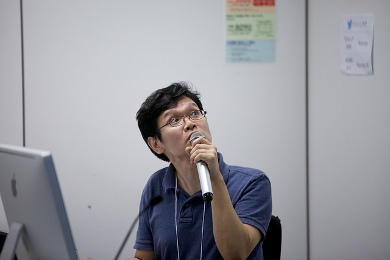
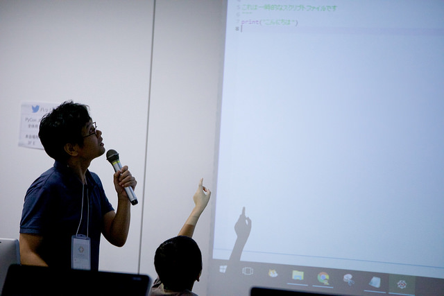

================================
第2回 プログラムチームのPyCon JP 2016
================================

はじめに
===========
執筆担当: @kimura

プログラムチームのPyCon JP 2016の過ごし方
==================================
執筆担当: プログラムチームメンバー
骨子: `SAR-1267 <https://pyconjp.atlassian.net/browse/SAR-1267>`_

トーク
------------------
.. sectionauthor:: Takayuki SHIMIZUKAWA

チュートリアル
-----------------------------
.. sectionauthor:: hata hirotaka

Youth Coder Workshop
---------------------------
.. sectionauthor:: Yuya Hamada

プログラムチーム、Youth Coder Workshop担当の濱田です。今年のPyCon JPでは子ども向けワークショップを「Youth Coder Workshop」と名前を改めて開催しました。小学校高学年から中高生向けに募集をして、30組近くの参加者に来場いただき、ワークショップを開催できました。

今年のYouth Coder Workshopの内容は自分の地図、「でんのう地図」を作ろうというものでした。

`Youth Coder Workshop <https://pycon.jp/2016/ja/events/youth-ws/>`_

講師・教材作成は昨年に引き続き、今年もICTプログラミングスクールの `TENTO <http://www.tento-net.com/>`_ さんに依頼しました。

昨年が好評だったため、プレッシャーがありましたが、昨年の反省点を反映させた運営ができたと思います。昨年は初めての試みだったこともあり、当日の参加者の受付が受付担当に引き継げてなくてドタバタだった部分がありました。今年は、受付人数や受付時の案内の方法を事細かにJIRAのチケットで事前に共有したことで、当日、参加者の皆様にスムーズに案内してもらうこと、すべての受付が完了したことをSlackで通知してもらえたこともあり、本来の作業である、教材のパソコンの設置・無線LANなどのセットアップに集中することができました。

`connpassページ <http://pyconjp.connpass.com/event/33979/>`_ の公開が7月でしたが、参加者の集まりが本格的に進んだのは9月に入ってからでした。広報活動としては、 `キャリアデザインセンターさん <http://type.jp/et/feature/1539>`_ 、 `Think ITさん <https://thinkit.co.jp/article/10646>`_ 、一番大きかったのは `ICT教育ニュースさん <http://ict-enews.net/2016/09/02pycon/>`_ と `リセマムさん <http://resemom.jp/article/2016/09/02/33564.html>`_ によるプレスリリースの公開だったと思います。

私自身がプログラミング教育に興味を持ってPyCon JPに参加したこともあり、TENTOさんに直接お伺いをして教室を見学させていただくことができました。子どもがどのようにプログラミングを学んでいるのか、Pythonはその中でどのような位置づけで扱っているのかを知ることができました。子どもがScratchやProcessingでプログラミングの考え方に慣れた頃合いでPythonを扱うのがちょうど良いのかな、など知見が得られたことは大きかったです。ありがとうございました。

ワークショップの内容は地図をつくるというところまでは行けましたが、自分の地図を作るところまで行けなかったのが惜しかったです。もっと子どもの自主性を重んじられるような時間を設けたりすればよかったのかなとおもいました。来年、もし開催するならば、Pythonの非常にシンプルで強力な言語を使って子どもたちの可能性を伸ばしていけるような、子ども自らが「こうしたい！」を後押しできるワークショップにしたいです。

また、今回のYouth Coder Workshopのノウハウを来年以降に活かせるように、苦労した点や先ほど述べたような受付のフローなど、マニュアルにまとめられる部分をスムーズにできるようにして、2017ではもっと創造的な活動ができるようにしていけたらな、と思っています。

今年は「でんのう地図」ということで地図を作るワークショップだったのですが、実は教材検討の段階でRaspberry Piを持ってこれないか画策したことがありました。また、終了後に思いついたのが、例えばゲームプログラミングで算数や数学がこう使われていますよ、などできると普段の学校の学習に意味を持たせられて楽しいのではないかとおもいました。

Raspberry Piのようにできないことはできないで結構苦労しました。しかし、プログラミング教育という分野はまだいろいろな人がやり方を模索している最中だと思います。子どもの数だけ正解がある、ここが難しいところだと思いますが、子どもの気付きにはいつも驚かされます。2017で壁にぶち当たって一緒に悩んだりしてみませんか！？

スプリント
----------------------
.. sectionauthor:: Tsou Liu

キーノート
---------------------
.. sectionauthor:: Kishin Yagami

招待講演
----------------------
.. sectionauthor:: Masuoka Hideto

ビギナーセッション
----------------------------------
.. sectionauthor:: Takayuki SHIMIZUKAWA

全体
--------------
.. sectionauthor:: Daisuke Saito

ライトニングトーク
-----------------------------
.. sectionauthor:: Kiyota

ポスターセッション
------------------------------
.. sectionauthor:: Kazuya Muramatsu

最後に
=========
.. sectionauthor:: ds110

執筆担当: プログラムチームメンバー
骨子: `SAR-1267 <https://pyconjp.atlassian.net/browse/SAR-1267>`_

