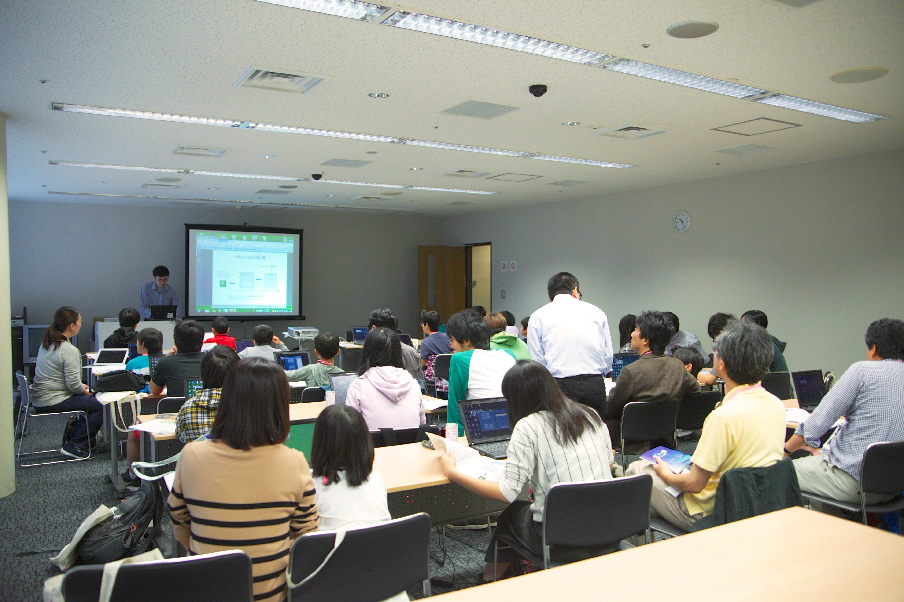

================================
第2回 プログラムについて
================================

.. note::
   以下のアウトラインは `去年のもの <https://codezine.jp/article/detail/8990>`_ です。
   あくまで例として記載したので、今年にあったアウトラインに変更をお願いします。

プログラム概要
===============

トークセッション
========================

トークセッション担当の清水川です。

今年は50のトーク枠に対して、計108件の応募がありました。
トークセッションへ応募していただいた皆さん、ありがとうございました。

今年の PyCon JP のテーマは ``Everyone’s different, all are wonderful.`` です。
多様性に富んだイベントにするためにはトークにも多様性が必要です。
`トークの選考`_ では、数人の審査員が思う「ニーズ」のありなしで評価するのではなく、発表者がどのような価値を参加者にもたらそうとしているかを評価し、分野と対象参加者レベルがまんべんなく分散することを目指しました。
採用された50のトークは `採用トーク一覧`_ で紹介されています。

.. _トークの選考: https://pyconjp.blogspot.jp/2016/07/pycon-jp-2016-accepted-talks.html
.. _採用トーク一覧: https://pycon.jp/2016/ja/schedule/talks/list/

トークの分野と対象参加者レベルを広くするため、今年のトークセッションは並列5トラック構成で、トータル50セッションとしました。
昨年までが「参加者がより多くのトークに参加できる構成」だとすると、今年は「参加者それぞれのレベルや目的にあったトークに集中できる構成」となっています。
また、各トーク時間のあとには休憩時間あります。トーク時間中に聞けなかったことやより詳しい話などがあれば、ぜひこの時間を使って発表者に聞いてみて下さい。
発表者と交流することには、現地参加でしか得られない価値がありますよ！

.. figure:: /_static/beforereport_02_program/discussion-after-talk.jpg
   :width: 300

   トーク後にスピーカーとディスカッション(PyCon JP 2015)

トーク内容は `採用トーク一覧`_ から参照できます。カンファレンス参加までに目を通しておくことで、イベントをより楽しめると思います。
いまからみなさんのトークを聞くのが楽しみですね。

ポスターセッション
========================
ポスターセッション担当の村松です。

今年のPyCon JP 2016では、ポスターセッションを実施します！
ポスターセッションとは、自分の研究や、やってみたことなどをポスター形式でまとめ、それをボードに掲示し参加者に説明することです。
トークセッションは45分間スピーカーの話を聞くのが中心となるのに対して、ポスターセッションは発表者と参加者が主体となって自由にディスカッションするのもよし、和気藹々と交流をするのもよしです。
また、7月末に募集を締め切り、みなさんから `たくさんの応募がありました。 <https://pycon.jp/2016/ja/proposals/vote_list/?category=poster>`_ どれも非常に面白そうな内容です。

開催概要ですが、実施日は9月22日(木)のお昼頃を予定しています。
9月22日は祝日で、多くの人の参加者が予想されます。
ポスターセッション会場はランチスペースのすぐ近くで、ランチやコーヒーブレイクと並行してポスターセッションを行えるので、賑わいながら発表を行う事ができます！！
参加者の方もぜひランチの行き帰りに、ポスター展示を見ていって下さい。

それでは、よろしくお願いします！

チュートリアル
===============
チュートリアル担当の畠です。

今年もカンファレンスの前日にPythonに関する有料のチュートリアルを開催します。今年は昨年と異なり企業やコミュニティの提供を受けてのチュートリアルとなります。そのため参加費用が半額以下になり講師以外にチューターもついてよりしっかりと内容を身につけられるようになっています。扱うテーマは、初心者向けPythonチュートリアル、データ分析、機械学習、ドキュメンテーションとなっています。ぜひご参加ください。詳細については `チュートリアルページ <https://pycon.jp/2016/ja/events/tutorial/>`_ でご確認ください。

参加登録は `PyCon JP 2016 チュートリアル チケット購入ページ <http://pyconjp.connpass.com/event/35206/>`_ からお願いします。 今年はチュートリアルへの参加に、PyCon JP 2016 のチケットが必要ありません。チュートリアルのみでもぜひ気軽にご参加ください。

概要
----------
- 日付: 2016年09月20日（火）
- 時間: 10:00 ~ 17:00（1時間の休憩有り）
- 場所: 早稲田大学西早稲田キャンパス63号館 1F
- 参加費: 4000円（お弁当付き）

`はじめてのPython3 〜画像変換による開発入門〜 <https://pycon.jp/2016/ja/events/tutorial/1/>`_
----------------------------------------------------------------------------------
`BeProud <http://www.beproud.jp/>`_ 提供によるPythonを初めて学ぶ方や始めたばかりの方を対象としたチュートリアルです。構文やデータ型、ライブラリの使い方、スクリプトファイルの作成及び実行などの基本的な使い方を習得できる内容となっています。

BeProudの講師の方に意気込みを伺いました。

.. image:: /_static/beforereport_02_program/beproud_logo.png

::

        　PythonはWebやデータサイエンスなど幅広い分野で使われるようになり、以前よりずっと身近な存在となりました。
        チュートリアルでは画像を取り扱うPillowというライブラリを題材に、あなただけのスクリプトを作ります。
        Python3の基本的な文法から公開ライブラリの使い方までをイチから学ぶことで、きっとプログラミングの楽しさを感じられるでしょう。
        今年があなたのPython元年となるように全力でサポートします！

`Python を用いたデータ分析入門 <https://pycon.jp/2016/ja/events/tutorial/2/>`_
-------------------------------------------------------------------
`DATUM STUDIO <https://datumstudio.jp/>`_ 提供によるデータ分析に興味がある方や始めてみたい方を対象としたチュートリアルです。ビジネスにおけるデータ分析の流れ、データの可視化（グラフの作成）、基礎統計量による分析（平均・分散など）、データの相関と回帰（重回帰分析）、データの分類（決定木分析）を習得できる内容となっています。

講師の戸嶋さんに意気込みを伺いました。

.. image:: /_static/beforereport_02_program/tojima.jpg

::

        　本チュートリアルではデータ分析初心者の方が Python コードを実際に動かしながら、データ分析の世界で使われる様々な手法を体験出来る内容となっています。
        チュートリアル終了後に皆様が関わっているサービスの改善に繋げられるように、DATUM STUDIO で関わってきたさまざまな分析を行った際のノウハウなども交えてお話したいと思います。

`Pythonで始めるディープラーニング入門 <https://pycon.jp/2016/ja/events/tutorial/3/>`_
------------------------------------------------------------------------
`NVIDIA <http://www.nvidia.co.jp/page/home.html>`_ 提供によるディープラーニングをこれから勉強しようとしている方や各ディープラーニング・フレームワークの特徴を理解したい方を対象としたチュートリアルです。ディープラーニングのフレームワーク、DIGITS、caffe、Torch7、theano、chainerなどの使い方を習得できる内容となっています。

講師の村上さんに意気込みを伺いました。

.. image:: /_static/beforereport_02_program/murakami.jpg

::

        　本チュートリアルでは、ディープラーニングの基礎を学ぶ事が可能です。ハンズオン形式で代表的なディープラーニングのフレームワークの特徴と使い方を学んでいきます。
        ディープラーニングの概要を短時間で学んでみたい、ディープラーニングに興味があるけれど、どのフレームワークを使っていいか分からないという方を対象に分かりやすく説明したいと思います。
        GPUコンピューティングとディープラーニングの面白さが伝わるように頑張ります。

`Sphinx ハンズオン <https://pycon.jp/2016/ja/events/tutorial/4/>`_
------------------------------------------------------
`Sphinxユーザー会 <http://sphinx-users.jp/>`_ 提供によるSphinxでドキュメントを作成したい方やもっと詳しく学びたい方を対象としたチュートリアルです。ハンズオンを通じて基本的な文法やビルドについて学べる内容となっています。

Sphinxユーザー会の講師の方に意気込みを伺いました。

.. image:: /_static/beforereport_02_program/sphinx.png

::

        　Sphinxは美しいドキュメントを簡単に生成することができるドキュメンテーションツールです。
        本チュートリアルでは、Sphinxプロジェクトの作成方法からはじめ、ドキュメントの書き方、ビルド方法をハンズオン形式で学んでいきます。
        これからSphinxをはじめてみようと考えている方や、Sphinxを導入しようとしているけど困っていることがある方の手助けができればと思います。

その他のプログラム企画
=======================

クロージングLT
--------------
プログラム担当の清田です。

今年もやってきました、楽しいクロージングLT大会です。
知らない方のために説明すると、LTとは、「Lightning Talk(稲妻トーク)」の略で5分間で行う発表(プレゼンテーション)のことです。
楽しくても5分、つまらなくても5分。より多くの人に発表する機会をもってもらうための企画です。Pythonに関係あっても無くてもOKです！

クロージングLTは、カンファレンス最後に参加者全員が、メイン会場に集まって行っています。発表者は全員の前で発表ができ、聞く人も含めた全ての参加者が一緒に、イベントを盛り上げます。今年は、どんなLTが発表されるのか楽しみですね。みんなで盛り上げましょう！

さて、開催概要ですが、今年は、各日の朝に名前を書いてもらい、先着順で発表してもらう予定です。
エントリーは、当日早い者勝ちで考えていますので、LTやるぞ！という方は早目に会場入りをしてください。
LTの時間は5分で、枠数は、1日目5枠、2日目7枠を予定してます。

LTへの参加お待ちしています！

招待講演
--------------
プログラムチームの舛岡です。
今年のPyCon JPのテーマは、「Everyone's different, all are wonderful.」で、このテーマに沿った企画が何かないかをプログラムチームで議論してました。その中で「PyCon JP参加者と接点が少ない分野の方々を招待し、参加者と講演者とが交流できる場所を提供すること」するために、招待講演をやろうということになりました。
今回は会場が大学ということにもちなんで、研究分野で一線で活躍されているお二人を招待することにしました。
一人目が、鷲崎弘宜（わしざきひろのり）さんです。

.. image:: /_static/beforereport_02_program/washizaki.jpg

早稲田大学グローバルソフトウェアエンジニアリング研究所所長、早稲田大学基幹理工学部情報理工学科教授、国立情報学研究所客員教授、株式会社システム情報社外取締役。博士（情報科学）

二人目が、得居誠也（とくいせいや）さん

.. image:: /_static/beforereport_02_program/tokui.jpg

株式会社Preferred Networksリサーチャー。深層学習フレームワークChainerの開発をリード
鷲崎先生、得居さん共に、研究分野とPythonについてお話しいただく予定です。

お二人ともプログラミング言語のカンファレンスに参加することは少ないので、ぜひこの機会に交流を深めてもらえればと思います。

Youth Coder Workshop
----------------------
プログラムチームの齋藤です。

今年も `プログラミングスクールTENTO <http://tento-net.com/>`_ のご協力の元、小中高生を対象にPythonのワークショップを開催します。
去年は、Pythonを使ってサンドボックスゲームのMinecraft上に壁画を描画するという内容でした。

    
さて、今年はPythonで「でんのう地図」をつくろうです。  

「でんのう地図」とは?
^^^^^^^^^^^^^^^^^^^^^^^^^^
かつて地図はかさばっていて使いにくいものでした。目的の場所を探すのに大変、苦労しました。
しかし、今やＰＣやスマホの普及によってインターネットで手軽に地図を見ることが出来るようになりました。
また、インターネット上のデータを使ってオリジナル地図の作成や公開することも容易です。
この、オリジナルの地図を「でんのう地図」と呼ぶことにしました。

本ワークショップでは小学生高学年から高校生までを対象に
Pythonを使ってインターネット上のデータ、
地図と組み合わせて世界に一つの「でんのう地図」を作成します。

内容は地図を作ろうといものですが、Pythonに触れたことがないお子様でも、
スタッフが丁寧に教えてくれますので十分に楽しめると思います。
是非、ご参加ください。チケットの価格は、3000円(同伴ありの場合4000円)です。
お昼ごはんが付きます。詳しくは、 `PyCon JP 2016 <https://pycon.jp/2016/ja/events/youth-ws/>`_  のサイトをご確認ください。

*本ワークショップは、要タイピングスキルとなっています。

